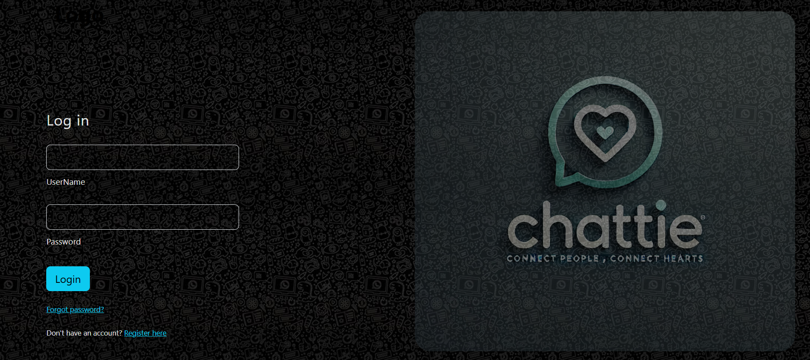

# Real-Time Chat Application

This is a full-stack real-time chat application that enables users to sign up, log in, and communicate with others. It features user authentication, real-time updates, and responsive design.

---

## Features

### Frontend
- Built with modern web technologies (e.g., React/Vite).
- User-friendly dark themed UI.
- User authentication and validation (signup, login, and logout).
- Toast notifications for user feedback.

### Backend
- Node.js/Express.js backend for handling API requests.
- MongoDB as the database to store user data.
- JWT-based authentication with cookies.
- WebSocket integration for real-time updates.


---

## Technologies Used

### Frontend
- **React** with Vite
- **CSS** for styling
- **React Hot-toast** for notifications

### Backend
- **Node.js** with Express
- **MongoDB** for the database
- **Socket.io** for real-time communication
- **Bcrypt** for password hashing
- **JWT** for authentication

---

## Installation and Setup

### Prerequisites
- Node.js and npm installed
- MongoDB database set up

### Clone the Repository
```bash
$ git clone https://github.com/lahiru-randika/real-time-chat-app.git
$ cd real-time-chat-app
```

### Backend Setup
1. Navigate to the backend folder:
```bash
$ cd backend
```
2. Install dependencies:
```bash
$ npm install
```
3. Create a `.env` file in the backend directory and configure the following:
```env
MONGO_URI=<your-mongodb-uri>
JWT_SECRET=<your-jwt-secret>
PORT=<your-port>
```
4. Start the backend server:
```bash
$ npm start
```

### Frontend Setup
1. Navigate to the frontend folder:
```bash
$ cd frontend
```
2. Install dependencies:
```bash
$ npm install
```
3. Build the frontend for production:
```bash
$ npm run build
```

---

## Folder Structure
```
real-time-chat-app/
|
├── frontend/         # Frontend source code
|   ├── src/
|   ├── dist/         # Build files
|
├── backend/          # Backend source code
|   ├── models/       # MongoDB models
|   ├── routes/       # API routes
|   ├── utils/        # Utility functions
|
└── README.md         # Project documentation
```

---

## Known Issues
- Make sure the MongoDB URI and JWT secrets are properly configured.

---

## Future Enhancements
- Add private messaging.
- Implement group chat functionality.
- Enhance UI with themes.
- Add file sharing support.

---

## UI Designs



